# Build Agent Plan — Z-Inflow / Asana Clone (x_gzi_zscaler_ppm)

> **Deprecated (2026-09):** This plan targeted the poisoned `x_gzi_ppm` app (`ca99d331…`) via ServiceNow Build Agent. **Do not execute these prompts.** Deploy from Cursor using **[DEPLOY.md](./DEPLOY.md)** to a new empty scoped app (`x_gzi_zscaler_ppm` or `x_gzi_inflow` after `npm run set-scope`).

Phased prompts for Build Agent to complete the **live** scoped app on `zscalerai.service-now.com`. Cursor (`main`) owns the production React BYOUI; Build Agent owns schema, server logic, ACLs, and shaped REST on **`x_gzi_zscaler_ppm`**.

---

## Scope credentials (historical — abandoned)

| App | Scope | scopeId (sys_app) | Role |
|-----|-------|-----------------|------|
| **Poisoned app (DO NOT USE)** | `x_gzi_ppm` | `ca99d331333687509937d1382e5c7be5` | RollbackContext poison after `--reinstall` |
| **New Cursor deploy target** | `x_gzi_zscaler_ppm` | *paste from Studio* | Empty app; Fluent source on `main` |
| **Legacy Cursor app** | `x_gzi_zflow` | `4bfbf57d333a07509937d1382e5c7bfa` | Rollback deploy only |

**Instance:** `https://zscalerai.service-now.com`  
**Branch mirror:** `instance-sync` (commit `2e4b82e+`) — audit-only transform snapshot of `x_gzi_zscaler_ppm`; never deploy from it.

---

## Gap analysis (instance-sync vs design doc vs main)

Snapshot date: transform succeeded 2026-08-24 against `x_gzi_zscaler_ppm`.

### Tables

| Design / main table | x_gzi_zscaler_ppm on instance | Status |
|---------------------|----------------------|--------|
| `x_gzi_zscaler_ppm_workspace` | ✓ | **DONE** |
| `x_gzi_zscaler_ppm_workspace_user` | — | **MISSING** (main has `x_gzi_zflow_workspace_user`) |
| `x_gzi_zscaler_ppm_workspace_team` | — | **MISSING** (main has `x_gzi_zflow_workspace_team`) |
| `x_gzi_zscaler_ppm_portfolio` | ✓ | **DONE** |
| `x_gzi_zscaler_ppm_portfolio_project` (M:M) | ✓ | **DONE** |
| `x_gzi_zscaler_ppm_portfolio_member` | ✓ | **DONE** (extends design; mirrors project_member pattern) |
| `x_gzi_zscaler_ppm_project` | ✓ | **DONE** |
| `x_gzi_zscaler_ppm_project_member` | ✓ | **DONE** |
| `x_gzi_zscaler_ppm_section` | ✓ | **DONE** |
| `x_gzi_zscaler_ppm_task` | ✓ | **DONE** |
| `x_gzi_zscaler_ppm_project_task` (multi-home) | ✓ | **DONE** |
| `x_gzi_zscaler_ppm_task_dependency` | — | **MISSING** (main has; required for Gantt deps) |
| `x_gzi_zscaler_ppm_resource_role` | ✓ | **DONE** |
| `x_gzi_zscaler_ppm_user_res_profile` | — | **MISSING** (main has `x_gzi_zflow_user_res_profile`) |
| `x_gzi_zscaler_ppm_user_capacity` | — | **MISSING** (main has `x_gzi_zflow_user_capacity`) |
| `x_gzi_zscaler_ppm_proj_res_alloc` | ✓ | **DONE** |
| `x_gzi_zscaler_ppm_capacity_plan` | ✓ | **DONE** |
| `x_gzi_zscaler_ppm_goal` | — | **MISSING** (main has `x_gzi_zflow_goal`) |
| `x_gzi_zscaler_ppm_status_update` | ✓ | **DONE** |
| `x_gzi_zscaler_ppm_custom_field_def` | ✓ | **DONE** |
| `x_gzi_zscaler_ppm_cust_field_setting` | — | **MISSING** (main has; links fields to project/portfolio) |
| `x_gzi_zscaler_ppm_custom_field_value` | ✓ | **DONE** |
| `x_gzi_zscaler_ppm_custom_view` | ✓ | **DONE** |
| `x_gzi_zscaler_ppm_custom_view_column` | ✓ | **DONE** |

**Summary:** 17 / 24 design tables present on instance. Seven tables missing; portfolio_project M:M is correctly implemented.

### Script Includes

| Service | x_gzi_zscaler_ppm instance | main (reference) | Status |
|---------|-------------------|------------------|--------|
| AccessService | ✓ | ✓ | **DONE** |
| MemberService | ✓ | ✓ | **DONE** |
| UserService | ✓ | ✓ | **DONE** |
| PortfolioService | ✓ | ✓ | **DONE** |
| ProjectTaskService | ✓ | ✓ | **DONE** |
| ViewDataService | ✓ | ✓ | **DONE** |
| CapacityService | ✓ | ✓ | **DONE** |

### Business Rules

| Rule | x_gzi_zscaler_ppm | Status |
|------|-----------|--------|
| EAV XOR Validation (`custom_field_value`) | ✓ | **DONE** |
| Task Single Assignee | ✓ | **DONE** |

### Scripted REST (`/api/x_gzi_zscaler_ppm/v1`)

**Present (52 operations):** portfolios CRUD, portfolio views/timeline/workload, portfolio↔project link/unlink, portfolio members CRUD, projects CRUD, project board/sections/tasks, project members CRUD, task update + multi-home projects, custom fields + values, capacity plans/grid/allocations, status-updates CRUD, user/group search, team members, views get/patch, section create/delete.

**Missing vs main shaped REST:**

| Route | Status |
|-------|--------|
| `GET /tasks/{id}` | **MISSING** (only PATCH exists) |
| `GET /portfolios/{id}/dashboard` | **MISSING** |
| `GET /portfolios/{id}/progress` | **MISSING** |
| `GET /capacity/plans/{id}` | **MISSING** |
| `GET /automations` | **MISSING** |
| `GET /intake-forms` | **MISSING** |
| `PATCH /sections/{id}` | **MISSING** (DELETE exists) |

**Ahead of main on instance:** full status-updates REST (main Fluent defines routes in Cursor code but instance-sync zflow snapshot lacked them).

### UI

| Artifact | x_gzi_zscaler_ppm | Status |
|----------|-----------|--------|
| UI Page `x_gzi_zscaler_ppm_app.do` | Build Agent stub (`app.tsx` + `@servicenow/react-components`) | **BROKEN** — violates architecture; replace with minimal HTML shell only |
| Application menu + modules | ✓ (generated) | **PARTIAL** — native list/form modules, not PM workspace |
| Full React PM workspace | — | **MISSING on ppm** — Cursor `main` has complete BYOUI at `x_gzi_zflow_workspace.do`; port after backend complete |

---

## Target data model (Mermaid ERD)

Logical names use **`x_gzi_zscaler_ppm_*`** table prefixes. Native SN tables untouched.

```mermaid
erDiagram
    SYS_USER ||--o{ SYS_USER_GRMEMBER : joins
    SYS_USER_GROUP ||--o{ SYS_USER_GRMEMBER : has

    SYS_USER {
        uuid sys_id PK
        string name
        string email
    }
    SYS_USER_GROUP {
        uuid sys_id PK
        string name
    }

    x_gzi_zscaler_ppm_workspace ||--o{ x_gzi_zscaler_ppm_workspace_user : contains
    SYS_USER ||--o{ x_gzi_zscaler_ppm_workspace_user : member_of
    x_gzi_zscaler_ppm_workspace ||--o{ x_gzi_zscaler_ppm_workspace_team : contains
    SYS_USER_GROUP ||--o{ x_gzi_zscaler_ppm_workspace_team : member_of

    x_gzi_zscaler_ppm_workspace {
        uuid sys_id PK
        string name
    }
    x_gzi_zscaler_ppm_workspace_user {
        uuid workspace_id PK_FK
        uuid user_id PK_FK
    }
    x_gzi_zscaler_ppm_workspace_team {
        uuid workspace_id PK_FK
        uuid group_id PK_FK
    }

    x_gzi_zscaler_ppm_workspace ||--o{ x_gzi_zscaler_ppm_portfolio : manages
    x_gzi_zscaler_ppm_workspace ||--o{ x_gzi_zscaler_ppm_project : manages
    x_gzi_zscaler_ppm_workspace ||--o{ x_gzi_zscaler_ppm_task : manages
    x_gzi_zscaler_ppm_workspace ||--o{ x_gzi_zscaler_ppm_goal : sets
    SYS_USER_GROUP ||--o{ x_gzi_zscaler_ppm_project : owns

    x_gzi_zscaler_ppm_portfolio ||--o{ x_gzi_zscaler_ppm_portfolio_project : links
    x_gzi_zscaler_ppm_project ||--o{ x_gzi_zscaler_ppm_portfolio_project : linked_from
    x_gzi_zscaler_ppm_portfolio ||--o{ x_gzi_zscaler_ppm_portfolio_member : has_access
    SYS_USER ||--o{ x_gzi_zscaler_ppm_portfolio_member : granted

    x_gzi_zscaler_ppm_portfolio {
        uuid sys_id PK
        uuid workspace_id FK
        string name
    }
    x_gzi_zscaler_ppm_portfolio_project {
        uuid portfolio_id PK_FK
        uuid project_id PK_FK
    }
    x_gzi_zscaler_ppm_portfolio_member {
        uuid sys_id PK
        uuid portfolio_id FK
        uuid user_id FK
        string role
    }

    x_gzi_zscaler_ppm_project ||--o{ x_gzi_zscaler_ppm_project_member : has_access
    SYS_USER ||--o{ x_gzi_zscaler_ppm_project_member : granted
    x_gzi_zscaler_ppm_project ||--o{ x_gzi_zscaler_ppm_section : defines
    x_gzi_zscaler_ppm_project ||--o{ x_gzi_zscaler_ppm_project_task : contains
    x_gzi_zscaler_ppm_task ||--o{ x_gzi_zscaler_ppm_project_task : belongs_to
    x_gzi_zscaler_ppm_section ||--o{ x_gzi_zscaler_ppm_project_task : organizes
    x_gzi_zscaler_ppm_task ||--o{ x_gzi_zscaler_ppm_task_dependency : blocks

    x_gzi_zscaler_ppm_project {
        uuid sys_id PK
        uuid workspace_id FK
        uuid assignment_group FK
        string name
        string status
    }
    x_gzi_zscaler_ppm_project_member {
        uuid sys_id PK
        uuid project_id FK
        uuid user_id FK
        string role
    }
    x_gzi_zscaler_ppm_section {
        uuid sys_id PK
        uuid project_id FK
        string name
        int order_index
    }
    x_gzi_zscaler_ppm_task {
        uuid sys_id PK
        uuid workspace_id FK
        uuid assignee_id FK
        string watch_list
        string name
        string description
    }
    x_gzi_zscaler_ppm_project_task {
        uuid project_id PK_FK
        uuid task_id PK_FK
        uuid section_id FK
        int order_index
    }
    x_gzi_zscaler_ppm_task_dependency {
        uuid sys_id PK
        uuid predecessor_id FK
        uuid successor_id FK
        string type
    }

    x_gzi_zscaler_ppm_resource_role ||--o{ x_gzi_zscaler_ppm_user_res_profile : defines
    SYS_USER ||--o{ x_gzi_zscaler_ppm_user_res_profile : has
    x_gzi_zscaler_ppm_user_res_profile ||--|| x_gzi_zscaler_ppm_user_capacity : establishes
    x_gzi_zscaler_ppm_project ||--o{ x_gzi_zscaler_ppm_proj_res_alloc : requests
    SYS_USER ||--o{ x_gzi_zscaler_ppm_proj_res_alloc : fulfills
    x_gzi_zscaler_ppm_resource_role ||--o{ x_gzi_zscaler_ppm_proj_res_alloc : required_as
    x_gzi_zscaler_ppm_capacity_plan ||--o{ x_gzi_zscaler_ppm_proj_res_alloc : groups

    x_gzi_zscaler_ppm_resource_role {
        uuid sys_id PK
        string name
    }
    x_gzi_zscaler_ppm_user_res_profile {
        uuid sys_id PK
        uuid user_id FK
        uuid role_id FK
    }
    x_gzi_zscaler_ppm_user_capacity {
        uuid sys_id PK
        uuid user_profile_id FK
        int baseline_hours_per_week
    }
    x_gzi_zscaler_ppm_proj_res_alloc {
        uuid sys_id PK
        uuid project_id FK
        uuid user_id FK
        uuid role_id FK
        decimal allocation_percentage
        date start_date
        date end_date
    }
    x_gzi_zscaler_ppm_capacity_plan {
        uuid sys_id PK
        uuid workspace_id FK
        string name
    }

    x_gzi_zscaler_ppm_workspace ||--o{ x_gzi_zscaler_ppm_goal : sets
    SYS_USER ||--o{ x_gzi_zscaler_ppm_goal : owns
    x_gzi_zscaler_ppm_goal ||--o{ x_gzi_zscaler_ppm_status_update : has
    x_gzi_zscaler_ppm_project ||--o{ x_gzi_zscaler_ppm_status_update : has
    x_gzi_zscaler_ppm_portfolio ||--o{ x_gzi_zscaler_ppm_status_update : has

    x_gzi_zscaler_ppm_goal {
        uuid sys_id PK
        uuid workspace_id FK
        uuid owner_id FK
        string name
        string status
    }
    x_gzi_zscaler_ppm_status_update {
        uuid sys_id PK
        string entity_type
        uuid entity_id
        uuid author_id FK
        string text
    }

    x_gzi_zscaler_ppm_workspace ||--o{ x_gzi_zscaler_ppm_custom_field_def : library
    x_gzi_zscaler_ppm_custom_field_def ||--o{ x_gzi_zscaler_ppm_cust_field_setting : added_to
    x_gzi_zscaler_ppm_project ||--o{ x_gzi_zscaler_ppm_cust_field_setting : uses
    x_gzi_zscaler_ppm_portfolio ||--o{ x_gzi_zscaler_ppm_cust_field_setting : uses
    x_gzi_zscaler_ppm_custom_field_def ||--o{ x_gzi_zscaler_ppm_custom_field_value : defines

    x_gzi_zscaler_ppm_custom_field_def {
        uuid sys_id PK
        uuid workspace_id FK
        string name
        string type
        boolean is_global_library
    }
    x_gzi_zscaler_ppm_cust_field_setting {
        uuid sys_id PK
        uuid field_def_id FK
        uuid project_id FK
        uuid portfolio_id FK
    }
    x_gzi_zscaler_ppm_custom_field_value {
        uuid sys_id PK
        uuid field_def_id FK
        string value_string
        decimal value_number
        date value_date
        uuid task_id FK
        uuid project_id FK
        uuid portfolio_id FK
    }

    x_gzi_zscaler_ppm_project ||--o{ x_gzi_zscaler_ppm_custom_view : has
    x_gzi_zscaler_ppm_portfolio ||--o{ x_gzi_zscaler_ppm_custom_view : has
    SYS_USER ||--o{ x_gzi_zscaler_ppm_custom_view : owns_private
    x_gzi_zscaler_ppm_custom_view ||--o{ x_gzi_zscaler_ppm_custom_view_column : contains

    x_gzi_zscaler_ppm_custom_view {
        uuid sys_id PK
        uuid project_id FK
        uuid portfolio_id FK
        uuid user_id FK
        string view_type
        string name
    }
    x_gzi_zscaler_ppm_custom_view_column {
        uuid sys_id PK
        uuid view_id FK
        string field_path
        int order_index
    }
```



---

## Architecture constraints (non-negotiable)

1. **Scope:** All artifacts in scope **`x_gzi_zscaler_ppm`** / `ca99d331333687509937d1382e5c7be5`. Table prefix **`x_gzi_zscaler_ppm_*`**. REST namespace **`/api/x_gzi_zscaler_ppm/v1`**.
2. **Never use `@servicenow/react-components`** in BYOUI — causes React #321 (invalid hook call). Current `x_gzi_zscaler_ppm_app.do` stub is **wrong**; leave a minimal static HTML shell until Cursor ports the real UI.
3. **Shaped REST only** — no new features on raw Table API (`/api/now/table/...`). All client/server integration goes through scoped Scripted REST.
4. **Members model** — `x_gzi_zscaler_ppm_project_member` and `x_gzi_zscaler_ppm_portfolio_member` with roles (Owner, Editor, Commenter, Viewer). ACLs driven by member tables + AccessService.
5. **Portfolio ↔ Project M:M** — `x_gzi_zscaler_ppm_portfolio_project` composite key; link/unlink via REST, not duplicate project rows.
6. **Multi-homing** — single `x_gzi_zscaler_ppm_task` row referenced by many `x_gzi_zscaler_ppm_project_task` rows; updates propagate everywhere.
7. **EAV XOR** — business rule on `x_gzi_zscaler_ppm_custom_field_value`: exactly one of `task_id`, `project_id`, `portfolio_id` populated.
8. **Single assignee** — business rule enforcing one assignee per task.
9. **Identity** — reference `sys_user` / `sys_user_group` only; no custom fields on native identity tables.
10. **Cursor owns React UI** — after Build Agent completes backend, Cursor ports `main` BYOUI (`src/client/*`, `x_gzi_zflow_workspace.do` patterns) to `x_gzi_zscaler_ppm`. Do not rebuild PM views in Build Agent.

---

## Build Agent prompts (copy-paste)

Run in order. Tag reflects gap analysis against live instance snapshot.

---

### 1. Workspace linking tables `[FULL]`

```
Scope: x_gzi_zscaler_ppm (ca99d331333687509937d1382e5c7be5) on zscalerai.service-now.com.

Create missing workspace M:M tables:
- x_gzi_zscaler_ppm_workspace_user (workspace_id → x_gzi_zscaler_ppm_workspace, user_id → sys_user, composite PK)
- x_gzi_zscaler_ppm_workspace_team (workspace_id → x_gzi_zscaler_ppm_workspace, group_id → sys_user_group, composite PK)

Add ACLs: read if user is workspace member (direct or via team). Do not add custom fields to sys_user or sys_user_group.

Reference main branch tables x_gzi_zflow_workspace_user / x_gzi_zflow_workspace_team for field parity.
```

---

### 2. Custom field settings table `[FULL]`

```
Scope: x_gzi_zscaler_ppm.

Create x_gzi_zscaler_ppm_cust_field_setting linking x_gzi_zscaler_ppm_custom_field_def to x_gzi_zscaler_ppm_project and/or x_gzi_zscaler_ppm_portfolio (nullable FKs with XOR: exactly one parent context per row).

Wire ACLs consistent with project/portfolio member roles. Keep existing EAV XOR rule on x_gzi_zscaler_ppm_custom_field_value unchanged.
```

---

### 3. Task dependencies table `[FULL]`

```
Scope: x_gzi_zscaler_ppm.

Create x_gzi_zscaler_ppm_task_dependency: predecessor_id and successor_id both reference x_gzi_zscaler_ppm_task, type choice (finish_to_start default). Prevent circular dependencies in before-insert/update business rule.

No REST yet — Cursor Gantt will consume via shaped REST in a later prompt.
```

---

### 4. Goals + capacity profile tables `[FULL]`

```
Scope: x_gzi_zscaler_ppm.

Create:
- x_gzi_zscaler_ppm_goal (workspace_id, owner_id → sys_user, name, status choice)
- x_gzi_zscaler_ppm_user_res_profile (user_id → sys_user, role_id → x_gzi_zscaler_ppm_resource_role)
- x_gzi_zscaler_ppm_user_capacity (user_profile_id → x_gzi_zscaler_ppm_user_res_profile, baseline_hours_per_week integer)

Goals link to x_gzi_zscaler_ppm_status_update via entity_type='goal'. Match design doc ERD field names.
```

---

### 5. Core REST gap fill — tasks, sections, capacity `[PARTIAL]`

```
Scope: x_gzi_zscaler_ppm. Extend PPM API (/api/x_gzi_zscaler_ppm/v1) — do NOT use Table API.

Add missing routes (mirror main x_gzi_zflow REST handlers conceptually):
- GET /tasks/{id} — return task with assignee, section memberships, custom field values
- PATCH /sections/{id} — rename/reorder section
- GET /capacity/plans/{id} — single plan metadata
- GET /portfolios/{id}/dashboard — aggregated task counts by status/section
- GET /portfolios/{id}/progress — completion percentage rollup

Use existing Script Includes (ProjectTaskService, PortfolioService, ViewDataService, CapacityService). Return JSON shapes consistent with other v1 routes.
```

---

### 6. Portfolio & project members REST verification `[SKIP]`

```
Scope: x_gzi_zscaler_ppm.

SKIP — instance already has full CRUD for /projects/{id}/members and /portfolios/{id}/members (GET/POST/PATCH/DELETE). Verify ACLs enforce Owner/Editor/Commenter/Viewer only; fix if any route returns 200 without member check.
```

---

### 7. Status updates REST verification `[SKIP]`

```
Scope: x_gzi_zscaler_ppm.

SKIP — instance already has GET/POST/PATCH/DELETE /status-updates. Confirm entity_type supports goal, project, portfolio. Add goal support if entity_type choice lacks 'goal'.
```

---

### 8. Multi-home project_task integrity `[PARTIAL]`

```
Scope: x_gzi_zscaler_ppm.

Audit x_gzi_zscaler_ppm_project_task M:M linker:
- POST /projects/{id}/tasks must create or link existing x_gzi_zscaler_ppm_task (never duplicate task rows for same logical work)
- GET /tasks/{id}/projects returns all project memberships with section_id and order_index
- PATCH /projects/{id}/board reorder updates order_index atomically

Add validation: task.workspace_id must match project.workspace_id.
```

---

### 9. Access control & ACL hardening `[PARTIAL]`

```
Scope: x_gzi_zscaler_ppm.

Review ACLs on all x_gzi_zscaler_ppm_* tables. Enforce:
- Write on project/task descendants requires project_member role Editor or Owner
- Portfolio write requires portfolio_member Editor or Owner
- Read respects Viewer+ membership

Ensure AccessService is invoked from REST handlers before mutations. Document any table still using overly permissive scoped ACLs.
```

---

### 10. Automation & intake stub routes `[FULL]`

```
Scope: x_gzi_zscaler_ppm.

Add stub Scripted REST routes (return empty arrays until tables exist):
- GET /automations — { "result": [] }
- GET /intake-forms — { "result": [] }

Register in PPM API v1. Cursor Rule Builder and Intake UI depend on these endpoints existing.
```

---

### 11. Remove react-components UI stub `[FULL]`

```
Scope: x_gzi_zscaler_ppm.

Replace x_gzi_zscaler_ppm_app.do BYOUI content: REMOVE all @servicenow/react-components imports (NowRecordListConnected, etc.).

Ship minimal static HTML: "Z-Inflow PM Workspace — UI loading via Cursor deploy" with no second React bundle. Keep endpoint x_gzi_zscaler_ppm_app.do registered.

Do NOT attempt to rebuild portfolio/project/board views here — Cursor owns React after backend is complete.
```

---

### 12. Business rules verification `[SKIP]`

```
Scope: x_gzi_zscaler_ppm.

SKIP — instance already has "EAV XOR Validation" and "Task Single Assignee" business rules on x_gzi_zscaler_ppm_custom_field_value and x_gzi_zscaler_ppm_task. Confirm active=true and order of execution. Re-create only if inactive.
```

---

## Cursor handoff (after Build Agent)

When prompts 1–5, 8–11 are **DONE** on `x_gzi_zscaler_ppm`:

1. Port `main` React BYOUI (`src/client/*`, `now.prebuild.mjs`) from **`x_gzi_zflow`** → **`x_gzi_zscaler_ppm`** scope prefix and `/api/x_gzi_zscaler_ppm/v1`.
2. Replace `x_gzi_zscaler_ppm_app.do` stub with full workspace page (equivalent of `x_gzi_zflow_workspace.do`).
3. Run `npm run build && npm run deploy` against **`x_gzi_zflow`** on `main` until explicit cutover; use `instance-sync` diff to verify ppm parity before switching production scope.

---

## Prompt index

| # | Title | Tag |
|---|-------|-----|
| 1 | Workspace linking tables | **FULL** |
| 2 | Custom field settings table | **FULL** |
| 3 | Task dependencies table | **FULL** |
| 4 | Goals + capacity profile tables | **FULL** |
| 5 | Core REST gap fill | **PARTIAL** |
| 6 | Portfolio & project members REST | **SKIP** |
| 7 | Status updates REST | **SKIP** |
| 8 | Multi-home project_task integrity | **PARTIAL** |
| 9 | Access control & ACL hardening | **PARTIAL** |
| 10 | Automation & intake stub routes | **FULL** |
| 11 | Remove react-components UI stub | **FULL** |
| 12 | Business rules verification | **SKIP** |
